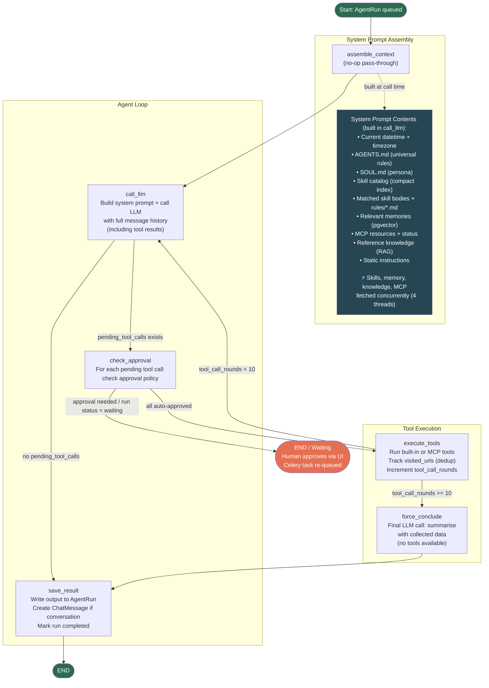

# Agent Loop Architecture

## Overview

Each agent run is a LangGraph state machine executed as a Celery task. The loop calls the LLM, executes tools, and repeats until the LLM produces a final reply or the round limit is reached.

## Flowchart



## Nodes

| Node | File | Description |
|------|------|-------------|
| `assemble_context` | `agent/graph/nodes.py` | No-op. Context is assembled lazily inside `call_llm`. |
| `call_llm` | `agent/graph/nodes.py` | Builds the full system prompt, appends conversation history and tool results, calls the LLM via LiteLLM. Returns tool calls or a final reply. |
| `check_approval` | `agent/graph/nodes.py` | Checks each pending tool call against its `ApprovalPolicy`. Creates `ToolExecution` records. If any require approval, sets run status to `waiting` and pauses at `END`. |
| `execute_tools` | `agent/graph/nodes.py` | Executes approved tool calls (built-in or MCP). Tracks `visited_urls` to block duplicate `web_read` calls. Increments `tool_call_rounds`. |
| `force_conclude` | `agent/graph/nodes.py` | Called when `tool_call_rounds >= 10`. Makes a final LLM call (no tools) asking it to summarise with collected data. |
| `save_result` | `agent/graph/nodes.py` | Writes output to `AgentRun.output`, creates a `ChatMessage` if a conversation is linked, marks run as `completed`. |

## State

Defined in `agent/graph/state.py` as a `TypedDict`:

| Field | Type | Description |
|-------|------|-------------|
| `run_id` | `str` | AgentRun PK |
| `agent_id` | `str` | Agent PK |
| `input` | `str` | Original user input |
| `conversation_id` | `str \| None` | Linked chat conversation |
| `output` | `str` | Final reply text |
| `pending_tool_calls` | `list[dict]` | Tool calls the LLM wants to make |
| `tool_results` | `list[dict]` | Results from the last execute_tools round |
| `assistant_tool_call_message` | `dict \| None` | Raw assistant message (required for OpenAI tool message format) |
| `tool_call_rounds` | `int` | Number of execute_tools rounds completed |
| `visited_urls` | `list[str]` | URLs already fetched (dedup) |
| `waiting_for_approval` | `bool` | Whether the run is paused for human approval |

## System Prompt Assembly

Built in `_build_system_context(query)` on every `call_llm` invocation. The four independent vector-DB / network lookups run **concurrently** via `ThreadPoolExecutor(max_workers=4)`:

| Step | Content | Source | Parallel? |
|------|---------|--------|-----------|
| 1 | Current datetime + timezone | `datetime.now()` | — |
| 2 | `AGENTS.md` | `workspace/AGENTS.md` | — |
| 3 | `SOUL.md` | `workspace/SOUL.md` | — |
| 4 | Skill catalog (compact index) | `build_skill_catalog()` | ✓ (parallel) |
| 5 | Matched skill bodies (+ `rules/*.md`) | `_build_skills_section()` | ✓ (parallel) |
| 6 | Relevant memories | pgvector top-5 | ✓ (parallel) |
| 7 | MCP resources | `always_include` URIs | ✓ (parallel) |
| 8 | MCP server connectivity status | `MCPConnectionPool` + `MCPRegistry` | — |
| 9 | Reference knowledge | RAG `retrieve_knowledge()` | ✓ (parallel) |
| 10 | Current conversation ID | State | — |
| 11 | Tool output formatting rule | Static | — |
| 12 | Parallel tool call instruction | Static | — |
| 13 | Reasoning transparency instruction | Static | — |

Total wall time for steps 4–7, 9 ≈ slowest single lookup (usually ~200 ms).

## Skills

Skills are discovered from multiple source directories via `collect_all_skills(check_db_trust=True)` and matched against the user query using a two-tier routing strategy:

### Routing — Primary: Embedding Similarity

`find_relevant_skills(query)` queries the `SkillEmbedding` table using pgvector cosine similarity. Only skills above `SIMILARITY_THRESHOLD` (default: 0.55) are matched. Each matching skill gets `match_reason="embedding"`.

The embedded text for each skill is: `name + description + triggers[:20] + examples[:10] + body[:500]`. `rules/*.md` files are **not** embedded — they are appended to the skill body only at injection time.

### Routing — Fallback: Keyword / Regex

Used only when no embedding match is found for a skill (e.g. embeddings not yet computed):
- **keyword**: `metadata.triggers` — case-insensitive substring against the query (`match_reason="keyword"`)
- **regex**: `metadata.trigger_patterns` — `re.search()` patterns (`match_reason="regex"`)

### Trust Model

Only skills from trusted sources are injected into the LLM context:
- `agent/workspace/skills/` — always trusted
- Other directories — require a `TrustedSkillSource` DB record (approved via the Skills UI)

Untrusted skills appear in the Skills UI for review but are silently excluded from context.

### Skill Index (Catalog)

`build_skill_catalog()` returns a compact table of **all** skills (name, description, trust status) that is always injected into the system prompt so the LLM knows what's available. Full skill bodies are only injected for matched (triggered) skills.

Triggered skill names are stored in `AgentRun.triggered_skills` and displayed as badges in the run detail UI.

See `.spec/008-on-demand-skills.md` (routing design), `.spec/022-skill-embeddings.md` (embedding routing), `.spec/023-multi-source-skills.md` (discovery), `.spec/025-skill-sync-anthropic-compliance.md` (sync commands).

## Tool Approval

Each tool has an `ApprovalPolicy`:
- `AUTO` — executed immediately, `ToolExecution` created with status `running`
- `REQUIRES_APPROVAL` — `ToolExecution` created with status `pending`, run paused at `waiting`

Human approval via the run detail UI re-queues the Celery task, which resumes from the saved `graph_state`.

## Parallel Tool Execution

`execute_tools` divides pending tool calls into two queues:

| Queue | Tools | Execution |
|-------|-------|-----------|
| Parallel | all except serial tools | `ThreadPoolExecutor` (max 8 workers, `AGENT_TOOL_PARALLELISM`) |
| Serial | `file_write`, `shell` | Sequential, after parallel batch completes |

All parallel tools from the same LLM response run concurrently. A `parallel_group` UUID is stamped on each `ToolExecution` in the batch so the UI can group them visually.

## Hard Limits

| Limit | Value | Config |
|-------|-------|--------|
| Max tool call rounds | 10 | `MAX_TOOL_CALL_ROUNDS` in `graph.py` |
| Max tool output size | 20,000 chars | `MAX_TOOL_OUTPUT_CHARS` in settings |
| Context history budget | 8,000 tokens (configurable) | `AGENT_CONTEXT_BUDGET_TOKENS` in settings |
| History window | 10 messages (configurable) | `AGENT_HISTORY_WINDOW` in settings |
| Parallel tool workers | 8 (configurable) | `AGENT_TOOL_PARALLELISM` in settings |
| Skill similarity threshold | 0.55 (configurable) | `AGENT_SKILL_SIMILARITY_THRESHOLD` in settings |

## Key Files

```
agent/
  graph/
    graph.py       # StateGraph definition, routing functions
    nodes.py       # Node implementations, _build_system_context (parallel assembly)
    state.py       # AgentState TypedDict
  models.py        # AgentRun, ToolExecution, SkillEmbedding, TrustedSkillSource, ...
  tools/           # Built-in tool implementations (auto-discovered)
  skills/
    discovery.py   # collect_all_skills() — multi-source with trust model
    embeddings.py  # find_relevant_skills(), _skill_embed_text(), build_skill_catalog()
    loader.py      # SkillLoader — reads and parses SKILL.md frontmatter
    registry.py    # SkillRegistry — in-memory index
  mcp/             # MCPConnectionPool, client (_unwrap_error), registry
  memory/          # long_term.py (pgvector search), short_term.py
  rag/             # retrieve_knowledge() (RAG retriever)
  workspace/
    AGENTS.md      # Universal agent rules
    SOUL.md        # Persona layer
    skills/        # Skill SKILL.md files (source of truth for workspace skills)
```
