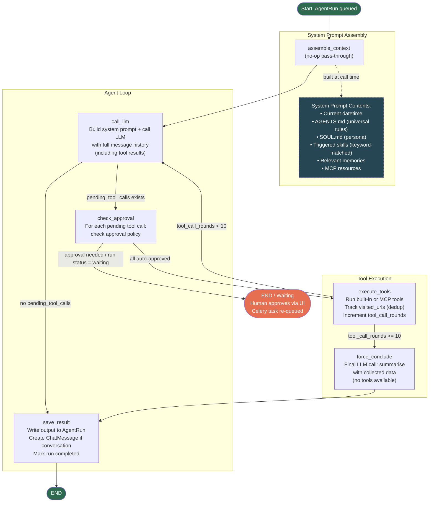

# Agent Loop Architecture

## Overview

Each agent run is a LangGraph state machine executed as a Celery task. The loop calls the LLM, executes tools, and repeats until the LLM produces a final reply or the round limit is reached.

## Flowchart



## Nodes

| Node | File | Description |
|------|------|-------------|
| `assemble_context` | `agent/graph/nodes.py` | No-op. Context is assembled lazily inside `call_llm`. |
| `call_llm` | `agent/graph/nodes.py` | Builds the full system prompt, appends conversation history and tool results, calls the LLM via LiteLLM. Returns tool calls or a final reply. |
| `check_approval` | `agent/graph/nodes.py` | Checks each pending tool call against its `ApprovalPolicy`. Creates `ToolExecution` records. If any require approval, sets run status to `waiting` and pauses at `END`. |
| `execute_tools` | `agent/graph/nodes.py` | Executes approved tool calls (built-in or MCP). Tracks `visited_urls` to block duplicate `web_read` calls. Increments `tool_call_rounds`. |
| `force_conclude` | `agent/graph/nodes.py` | Called when `tool_call_rounds >= 10`. Makes a final LLM call (no tools) asking it to summarise with collected data. |
| `save_result` | `agent/graph/nodes.py` | Writes output to `AgentRun.output`, creates a `ChatMessage` if a conversation is linked, marks run as `completed`. |

## State

Defined in `agent/graph/state.py` as a `TypedDict`:

| Field | Type | Description |
|-------|------|-------------|
| `run_id` | `str` | AgentRun PK |
| `agent_id` | `str` | Agent PK |
| `input` | `str` | Original user input |
| `conversation_id` | `str \| None` | Linked chat conversation |
| `output` | `str` | Final reply text |
| `pending_tool_calls` | `list[dict]` | Tool calls the LLM wants to make |
| `tool_results` | `list[dict]` | Results from the last execute_tools round |
| `assistant_tool_call_message` | `dict \| None` | Raw assistant message (required for OpenAI tool message format) |
| `tool_call_rounds` | `int` | Number of execute_tools rounds completed |
| `visited_urls` | `list[str]` | URLs already fetched (dedup) |
| `waiting_for_approval` | `bool` | Whether the run is paused for human approval |

## System Prompt Assembly

Built in `_build_system_context(query)` on every `call_llm` invocation:

1. **Current datetime** — injected as the first line (`2026-03-21 14:33:53 UTC (Saturday)`)
2. **`AGENTS.md`** — universal behavioural rules (workspace file)
3. **`SOUL.md`** — persona/tone layer (workspace file, optional)
4. **Skills** — keyword-matched against the user query; full `SKILL.md` body injected for matched skills, compact index for all skills
5. **Relevant memories** — top-5 long-term memory excerpts via vector search
6. **MCP resources** — any MCP server resources marked `always_include`

## Skills

Skills live in `workspace/skills/<name>/SKILL.md`. Each has a `triggers` list in its YAML frontmatter. The system matches triggers (case-insensitive substring) against the user query and injects the full skill body only for matched skills. Triggered skill names are stored in `AgentRun.triggered_skills` and displayed as badges in the run detail UI.

See `.spec/008-on-demand-skills.md` for full design.

## Tool Approval

Each tool has an `ApprovalPolicy`:
- `AUTO` — executed immediately, `ToolExecution` created with status `running`
- `REQUIRES_APPROVAL` — `ToolExecution` created with status `pending`, run paused at `waiting`

Human approval via the run detail UI re-queues the Celery task, which resumes from the saved `graph_state`.

## Hard Limits

| Limit | Value | Config |
|-------|-------|--------|
| Max tool call rounds | 10 | `MAX_TOOL_CALL_ROUNDS` in `graph.py` |
| Max tool output size | 20,000 chars | `MAX_TOOL_OUTPUT_CHARS` in settings |
| Context history budget | configurable tokens | `AGENT_CONTEXT_BUDGET_TOKENS` in settings |

## Key Files

```
agent/
  graph/
    graph.py       # StateGraph definition, routing functions
    nodes.py       # Node implementations, _build_system_context
    state.py       # AgentState TypedDict
  models.py        # AgentRun, ToolExecution
  tools/           # Built-in tool implementations
  skills/          # SkillRegistry, SkillLoader
  mcp/             # MCP connection pool, client, registry
  workspace/
    AGENTS.md      # Universal agent rules
    SOUL.md        # Persona layer
    skills/        # Skill SKILL.md files
```
