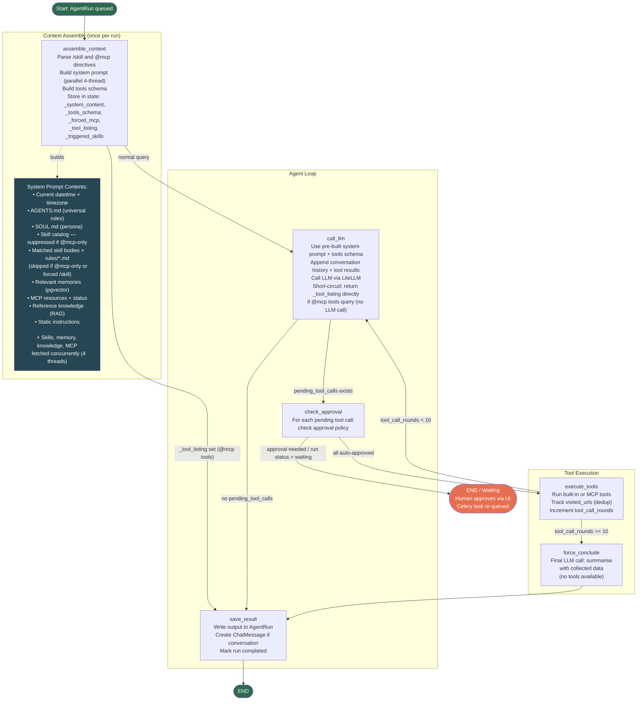

# Agent Loop Architecture

## Overview

Each agent run is a LangGraph state machine executed as a Celery task. The loop calls the LLM, executes tools, and repeats until the LLM produces a final reply or the round limit is reached.

## Flowchart



## Nodes

| Node | File | Description |
|------|------|-------------|
| `assemble_context` | `agent/graph/nodes.py` | Parses `/skill` and `@mcp` directives from input. Builds system prompt (parallel 4-thread), tools schema, and persists context trace to `AgentRun`. Stores pre-built content in state so `call_llm` can reuse it across rounds. If `@mcp tools` query detected, sets `_tool_listing` for short-circuit return. |
| `call_llm` | `agent/graph/nodes.py` | Uses pre-built system prompt and tools schema from state. Appends conversation history and tool results, calls the LLM via LiteLLM. If `_tool_listing` is set, returns the listing immediately without calling the LLM. Returns tool calls or a final reply. |
| `check_approval` | `agent/graph/nodes.py` | Checks each pending tool call against its `ApprovalPolicy`. Creates `ToolExecution` records. If any require approval, sets run status to `waiting` and pauses at `END`. |
| `execute_tools` | `agent/graph/nodes.py` | Executes approved tool calls (built-in or MCP). Tracks `visited_urls` to block duplicate `web_read` calls. Increments `tool_call_rounds`. |
| `force_conclude` | `agent/graph/nodes.py` | Called when `tool_call_rounds >= 10`. Makes a final LLM call (no tools) asking it to summarise with collected data. |
| `save_result` | `agent/graph/nodes.py` | Writes output to `AgentRun.output`, creates a `ChatMessage` if a conversation is linked, marks run as `completed`. |

## State

Defined in `agent/graph/state.py` as a `TypedDict`:

| Field | Type | Description |
|-------|------|-------------|
| `run_id` | `str` | AgentRun PK |
| `agent_id` | `str` | Agent PK |
| `input` | `str` | Original user input |
| `conversation_id` | `str \| None` | Linked chat conversation |
| `output` | `str` | Final reply text |
| `pending_tool_calls` | `list[dict]` | Tool calls the LLM wants to make |
| `tool_results` | `list[dict]` | Results from the last execute_tools round |
| `assistant_tool_call_message` | `dict \| None` | Raw assistant message (required for OpenAI tool message format) |
| `tool_call_rounds` | `int` | Number of execute_tools rounds completed |
| `visited_urls` | `list[str]` | URLs already fetched (dedup) |
| `waiting_for_approval` | `bool` | Whether the run is paused for human approval |
| `_system_content` | `str` | Pre-built system prompt (set by `assemble_context`) |
| `_tools_schema` | `list[dict]` | Pre-built tools schema (filtered by `_forced_mcp` if set) |
| `_triggered_skills` | `list[str]` | Skill names matched for this query |
| `_skill_dir_map` | `dict[str, str]` | Skill name → directory path mapping |
| `_rag_matches` | `list[dict]` | RAG knowledge matches |
| `_context_trace` | `dict` | Context assembly metadata (skills, memory, MCP) |
| `_model` | `str` | LLM model resolved for this run |
| `_forced_mcp` | `str \| None` | MCP server name from `@mcp-name` directive |
| `_tool_listing` | `str \| None` | Pre-formatted tool listing for `@mcp tools` short-circuit |

## Input Directives

Two special prefixes can be used in the chat input to control routing:

### `/skill-name` — Force a specific skill

When input starts with `/skill-name`, only that skill is injected into the system prompt. All embedding/keyword routing is bypassed. The skill catalog is still included.

```
/edwm-wip-movement what is today's move count?
```

### `@mcp-name` — Force a specific MCP server

When input contains `@mcp-name`, only that server's tools are included in the LLM tools schema. Additionally:
- All skill routing is **suppressed** (no skill injection, no skill catalog)
- `mcp_servers_active` in the progress UI shows only the targeted server
- `@` in the chat input triggers an autocomplete dropdown listing configured MCP servers

```
@fab-mcp get all lots on hold at diffusion
```

### `@mcp-name tools` — List tools without LLM call

When input matches `@mcp-name tools`, the agent returns the tool listing for that server immediately — no LLM call, no tokens consumed.

```
@fab-mcp tools
```

### Combining directives

`/skill` and `@mcp` can be combined. `/skill` restores skill injection even when `@mcp` is set:

```
/edwm-wip-movement @fab-mcp query lots at step 1000
```

| Input pattern | Skills injected | MCP tools schema |
|--------------|----------------|-----------------|
| plain query | pgvector routing | all servers |
| `/skill query` | named skill only | all servers |
| `@mcp query` | **none** | named server only |
| `/skill @mcp query` | named skill only | named server only |

## System Prompt Assembly

Built in `_build_system_context(query, forced_skill, suppress_skills)` once per run inside `assemble_context`. The four independent vector-DB / network lookups run **concurrently** via `ThreadPoolExecutor(max_workers=4)`:

| Step | Content | Source | Parallel? | Suppressed when |
|------|---------|--------|-----------|----------------|
| 1 | Current datetime + timezone | `datetime.now()` | — | — |
| 2 | `AGENTS.md` | `workspace/AGENTS.md` | — | — |
| 3 | `SOUL.md` | `workspace/SOUL.md` | — | — |
| 4 | Skill catalog (compact index) | `build_skill_catalog()` | — | `@mcp`-only mode |
| 5 | Matched skill bodies (+ `rules/*.md`) | `_build_skills_section()` | ✓ (parallel) | `@mcp`-only mode |
| 6 | Relevant memories | pgvector top-5 | ✓ (parallel) | — |
| 7 | MCP resources | `always_include` URIs | ✓ (parallel) | — |
| 8 | MCP server connectivity status | `MCPConnectionPool` + `MCPRegistry` | — | — |
| 9 | Reference knowledge | RAG `retrieve_knowledge()` | ✓ (parallel) | — |
| 10 | Current conversation ID | State | — | — |
| 11 | Tool output formatting rule | Static | — | — |
| 12 | Parallel tool call instruction | Static | — | — |
| 13 | Reasoning transparency instruction | Static | — | — |

Total wall time for steps 5–7, 9 ≈ slowest single lookup (usually ~200 ms).

## Skills

Skills are discovered from multiple source directories via `collect_all_skills(check_db_trust=True)` and matched against the user query using a two-tier routing strategy.

> **Routing is skipped entirely** when `@mcp-only` mode is active (`@mcp-name` without `/skill`). `_build_skills_section` returns empty immediately — no pgvector query, no skill catalog.

### Routing — Force: `/skill-name` directive

When the input starts with `/skill-name`, only that named skill is looked up and injected. Embedding and keyword routing are bypassed entirely (`match_reason="slash"`).

### Routing — Primary: Embedding Similarity

`find_relevant_skills(query)` queries the `SkillEmbedding` table using pgvector cosine similarity. Only skills above `SIMILARITY_THRESHOLD` (default: 0.55) are matched. Each matching skill gets `match_reason="embedding"`.

The embedded text for each skill is: `name + description + triggers[:20] + examples[:10] + body[:500]`. `rules/*.md` files are **not** embedded — they are appended to the skill body only at injection time.

### Routing — Fallback: Keyword / Regex

Used only when no embedding match is found for a skill (e.g. embeddings not yet computed):
- **keyword**: `metadata.triggers` — case-insensitive substring against the query (`match_reason="keyword"`)
- **regex**: `metadata.trigger_patterns` — `re.search()` patterns (`match_reason="regex"`)

### Trust Model

Only skills from trusted sources are injected into the LLM context:
- `agent/workspace/skills/` — always trusted
- Other directories — require a `TrustedSkillSource` DB record (approved via the Skills UI)

Untrusted skills appear in the Skills UI for review but are silently excluded from context.

### Skill Index (Catalog)

`build_skill_catalog()` returns a compact table of **all** skills (name, description, trust status) that is always injected into the system prompt so the LLM knows what's available. Full skill bodies are only injected for matched (triggered) skills. The catalog is suppressed in `@mcp`-only mode.

Triggered skill names are stored in `AgentRun.triggered_skills` and displayed as badges in the run detail UI.

See `.spec/008-on-demand-skills.md` (routing design), `.spec/022-skill-embeddings.md` (embedding routing), `.spec/023-multi-source-skills.md` (discovery), `.spec/025-skill-sync-anthropic-compliance.md` (sync commands).

## Tool Approval

Each tool has an `ApprovalPolicy`:
- `AUTO` — executed immediately, `ToolExecution` created with status `running`
- `REQUIRES_APPROVAL` — `ToolExecution` created with status `pending`, run paused at `waiting`

Human approval via the run detail UI re-queues the Celery task, which resumes from the saved `graph_state`.

## Parallel Tool Execution

`execute_tools` divides pending tool calls into two queues:

| Queue | Tools | Execution |
|-------|-------|-----------|
| Parallel | all except serial tools | `ThreadPoolExecutor` (max 8 workers, `AGENT_TOOL_PARALLELISM`) |
| Serial | `file_write`, `shell` | Sequential, after parallel batch completes |

All parallel tools from the same LLM response run concurrently. A `parallel_group` UUID is stamped on each `ToolExecution` in the batch so the UI can group them visually.

## Hard Limits

| Limit | Value | Config |
|-------|-------|--------|
| Max tool call rounds | 10 | `MAX_TOOL_CALL_ROUNDS` in `graph.py` |
| Max tool output size | 20,000 chars | `MAX_TOOL_OUTPUT_CHARS` in settings |
| Context history budget | 8,000 tokens (configurable) | `AGENT_CONTEXT_BUDGET_TOKENS` in settings |
| History window | 10 messages (configurable) | `AGENT_HISTORY_WINDOW` in settings |
| Parallel tool workers | 8 (configurable) | `AGENT_TOOL_PARALLELISM` in settings |
| Skill similarity threshold | 0.55 (configurable) | `AGENT_SKILL_SIMILARITY_THRESHOLD` in settings |

## Key Files

```
agent/
  graph/
    graph.py       # StateGraph definition, routing functions
    nodes.py       # Node implementations, _build_system_context (parallel assembly),
                   # _parse_slash_skill(), _parse_at_mcp(), _is_mcp_tools_query(),
                   # _format_mcp_tool_listing(), _build_tools_schema()
    state.py       # AgentState TypedDict (inc. _forced_mcp, _tool_listing, _system_content, ...)
  models.py        # AgentRun, ToolExecution, SkillEmbedding, TrustedSkillSource, ...
  tools/           # Built-in tool implementations (auto-discovered)
  skills/
    discovery.py   # collect_all_skills() — multi-source with trust model
    embeddings.py  # find_relevant_skills(), _skill_embed_text(), build_skill_catalog()
    loader.py      # SkillLoader — reads and parses SKILL.md frontmatter
    registry.py    # SkillRegistry — in-memory index
  mcp/
    config.py      # MCPServerConfig dataclass + load/save/upsert/remove (mcp_servers.json)
    pool.py        # MCPConnectionPool singleton
    registry.py    # MCPRegistry — tool lookup (entry.server_name for filtering)
    client.py      # SSE/stdio client, _unwrap_error()
  memory/          # long_term.py (pgvector search), short_term.py
  rag/             # retrieve_knowledge() (RAG retriever)
  workspace/
    AGENTS.md      # Universal agent rules
    SOUL.md        # Persona layer
    mcp_servers.json  # MCP server config (source of truth, replaces MCPServer model)
    skills/        # Skill SKILL.md files (source of truth for workspace skills)
```
