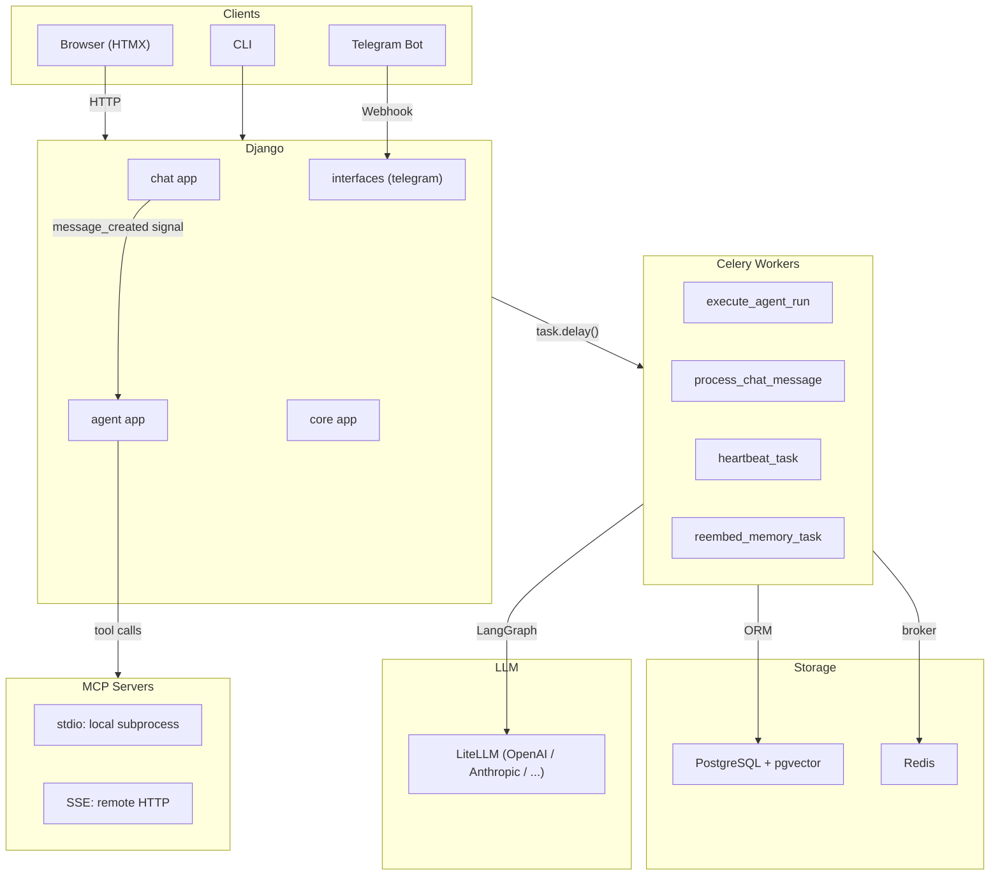
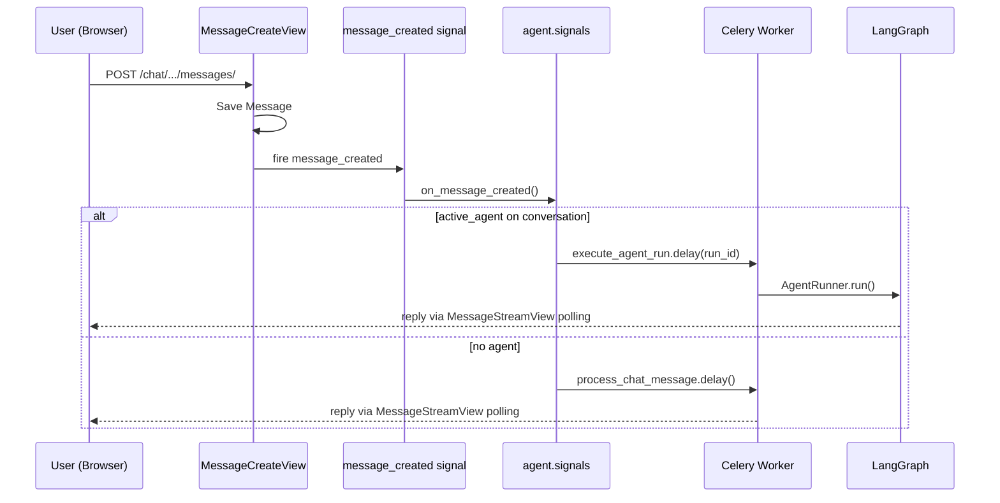
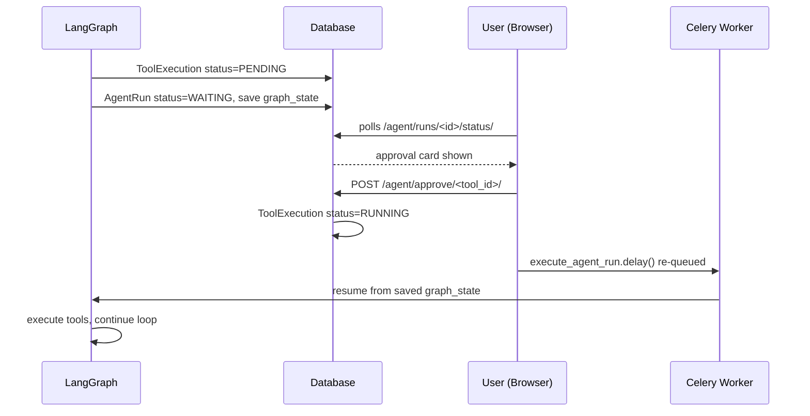

# System Architecture

## Overview

A Django-based AI agent platform with real-time chat, autonomous agent execution via LangGraph, MCP server integration, a workspace-driven skill system, and vector memory. Designed around HTMX for frontend interactivity and Celery for async task processing.

---

## High-Level Component Diagram



---

## Django Apps

### `chat` — Conversations & simple LLM chat

**Models**
- `Conversation` — tracks interface (web/telegram/cli), active agent, model config, system prompt, temperature
- `Message` — individual messages with role (user/assistant/system/tool) and token counts

**Key views** (all HTMX-enabled)
- `ConversationDetailView` — full chat interface
- `MessageCreateView` — saves user message, fires `message_created` signal
- `MessageStreamView` — polling endpoint; returns typing indicator or assistant reply
- `ConversationAgentToggleView` — enable/disable agent for a conversation

**Flow**: User types → `MessageCreateView` saves message → fires signal → `agent.signals.on_message_created` creates `AgentRun` and queues Celery task → `MessageStreamView` polls until reply appears.

---

### `agent` — Agent orchestration, tools, memory, MCP

**Models**
- `Agent` — name, system prompt, tools list, model, `is_default`
- `AgentRun` — execution record: status, input/output, graph_state (JSON), triggered_skills
- `ToolExecution` — audit log per tool call: status, input, output, duration_ms, approval
- `MCPServer` — MCP server config (transport, command/url, encrypted env, auto_approve_tools)
- `Memory` — long-term memory paragraphs with pgvector embeddings (1536-dim)
- `LLMUsage` — token counts and estimated cost per LLM call
- `Skill` — registry of installed skills with path and enabled flag
- `HeartbeatLog` — records each heartbeat trigger

**Execution**: `AgentRunner` → `build_graph()` → LangGraph `StateGraph.invoke()`. See [agent-loop.md](agent-loop.md) for the full flowchart.

---

### `core` — Shared utilities

- `TimeStampedModel` — abstract base with `created_at`, `updated_at`
- `core.llm.get_completion()` — LiteLLM call with usage tracking
- `core.memory.embed_text()` — OpenAI `text-embedding-3-small` via LiteLLM
- `core.memory.search_memories()` — cosine similarity search in pgvector

---

## Agent Loop (LangGraph)

See [agent-loop.md](agent-loop.md) for the full flowchart. Summary:


**State** carried between iterations: `pending_tool_calls`, `tool_results`, `assistant_tool_call_message`, `tool_call_rounds`, `visited_urls`, `output`.

---

## System Prompt Assembly

Built in `_build_system_context(query)` on every LLM call:

| Order | Content | Source |
|-------|---------|--------|
| 1 | Current datetime | `datetime.now()` |
| 2 | Universal rules | `workspace/AGENTS.md` |
| 3 | Persona/tone | `workspace/SOUL.md` |
| 4 | Triggered skills | `workspace/skills/*/SKILL.md` (keyword-matched) |
| 5 | Relevant memories | pgvector top-5 similarity search |
| 6 | MCP resources | `always_include` resource URIs |

---

## Skill System

Skills live in `workspace/skills/<name>/SKILL.md` with YAML frontmatter:

```yaml
---
name: web-research
description: Searching the web and finding current information
triggers: [search, web, browse, news, price, statistic]
version: 1
---

## Full instructions here...
```

- **Trigger matching**: keywords checked (case-insensitive substring) against the user query
- **Matched skills**: full body injected into system prompt; all others shown as compact index
- **Handler skills**: optional `handler.py` with `run()` exposes skill as an LLM-callable tool
- **Triggered skills** stored in `AgentRun.triggered_skills`, shown as badges in the run UI

Built-in skills: `charts`, `web-research`, `data-analysis`.

---

## Tool System

Tools are auto-discovered from `agent/tools/*.py` (any `BaseTool` subclass):

| Tool | Description | Approval |
|------|-------------|----------|
| `file_read` | Read workspace files | Auto |
| `file_write` | Write workspace files | Auto |
| `web_read` | Fetch URLs (dedup enforced) | Auto |
| `shell` | Execute shell commands | Requires approval |
| `api_get` / `api_post` | HTTP requests | Auto |
| `get_datetime` | Current date/time with timezone | Auto |
| `chart` | Generate matplotlib charts | Auto |

MCP tools are discovered dynamically from connected MCP servers and registered alongside built-ins.

---

## Background Tasks (Celery)

| Task | Trigger | Description |
|------|---------|-------------|
| `execute_agent_run` | Signal / tool approval | Run or resume a LangGraph agent run |
| `process_chat_message` | User message (no agent) | Call LLM for plain chat reply |
| `heartbeat_task` | Celery Beat (every 30 min) | Read `HEARTBEAT.md`, create AgentRun for unchecked items |
| `reembed_memory_task` | Manual / file write | Re-embed changed paragraphs in `MEMORY.md` into pgvector |

**Infrastructure**: Redis as broker and result backend. `django_celery_beat` for schedule management.

---

## Memory Systems

**Short-term**: LangGraph `AgentState` (in-memory during run, cleared after).

**Long-term**: pgvector in PostgreSQL.
- Source: `workspace/memory/MEMORY.md` — free-text paragraphs
- Embedding model: `openai/text-embedding-3-small` (1536 dimensions)
- Index: HNSW with cosine distance
- Recall: top-5 most similar paragraphs injected into every system prompt
- Re-embedding: paragraph-level hash diffing (only changed paragraphs re-embedded)

**Conversation history**: last N messages truncated to `AGENT_CONTEXT_BUDGET_TOKENS` (default: 8,000).

---

## MCP Integration

`MCPConnectionPool` is a singleton with a dedicated async event loop in a background thread. It manages connections to all enabled `MCPServer` instances.

**Transports**
- `stdio` — local subprocess (e.g. `npx -y @modelcontextprotocol/server-brave-search`)
- `SSE` — remote HTTP streaming endpoint

**Features**
- Tool discovery on connect (registered into `MCPRegistry`)
- `always_include` resource URIs injected into every system prompt
- Per-server `auto_approve_tools` list
- Encrypted env vars (`EncryptedJSONField` using Fernet)
- Connection status tracked in `MCPServer.connection_status`

---

## Signal & Event Flow



### Tool Approval Flow



---

## URL Structure

```
/chat/                                         Conversation list
/chat/conversations/<id>/                      Chat interface
/chat/conversations/<id>/messages/             POST new message
/chat/conversations/<id>/messages/<id>/stream/ Poll for reply

/agent/                                        Dashboard
/agent/runs/                                   Run list
/agent/runs/<id>/                              Run detail + tool trace
/agent/runs/<id>/status/                       HTMX polling fragment
/agent/agents/                                 Agent CRUD
/agent/tools/                                  Tool registry
/agent/skills/                                 Skill management
/agent/memory/                                 Memory editor + search
/agent/mcp/                                    MCP server config
/agent/workspace/<filename>/                   Workspace file editor
/agent/monitoring/                             Usage + health
```

---

## Frontend Stack

| Library | Version | Usage |
|---------|---------|-------|
| HTMX | 2.0.4 | Partial updates, polling, OOB swaps |
| Alpine.js | 3.14.1 | Local UI state (toggles, collapse) |
| Tailwind CSS | CDN | Styling |
| marked.js | CDN | Markdown rendering in chat |

**Patterns**:
- `hx-swap-oob` — update elements outside the main swap target (status badge, sidebar title)
- `hx-trigger="every 2s"` — polling for run status and message stream
- Template convention: `_partial.html` prefix for HTMX fragments

---

## Workspace Directory

```
agent/workspace/
├── AGENTS.md              Universal agent behaviour rules
├── SOUL.md                Persona and tone layer
├── HEARTBEAT.md           Periodic task checklist (- [ ] format)
├── memory/
│   └── MEMORY.md          Long-term memory (embedded into pgvector)
├── skills/
│   ├── charts/SKILL.md
│   ├── web-research/SKILL.md
│   └── data-analysis/SKILL.md
└── chart_*.png            Generated chart images
```

All files are editable via the Agent UI at `/agent/workspace/`.

---

## Configuration

Settings split across `config/settings/`:
- `base.py` — shared: DB, LiteLLM, Redis, Celery, workspace paths
- `local.py` — dev: `DEBUG=True`
- `production.py` — prod: hardened

Key environment variables:

| Variable | Purpose |
|----------|---------|
| `DATABASE_URL` | PostgreSQL connection |
| `REDIS_URL` | Celery broker/backend |
| `LITELLM_DEFAULT_MODEL` | Default LLM (e.g. `openai/gpt-4o-mini`) |
| `FERNET_KEY` | MCP env encryption |
| `TELEGRAM_BOT_TOKEN` | Telegram integration |
| `LANGSMITH_API_KEY` | LangSmith tracing (optional) |
| `MAX_TOOL_OUTPUT_CHARS` | Tool output truncation (default: 20,000) |
| `AGENT_CONTEXT_BUDGET_TOKENS` | History truncation budget (default: 8,000) |

---

## Key Files

```
config/
  celery.py              Celery app, MCP pool init/shutdown hooks
  urls.py                Root URL routing

chat/
  models.py              Conversation, Message
  views.py               HTMX views
  services.py            ChatService (LLM reply)
  signals.py             message_created signal

agent/
  models.py              Agent, AgentRun, MCPServer, Memory, ...
  views.py               Dashboard, CRUD, approval, monitoring
  runner.py              AgentRunner (sync executor + resumption)
  signals.py             on_message_created → trigger agent run
  tasks.py               Celery tasks
  graph/
    graph.py             LangGraph StateGraph + routing
    nodes.py             Node functions + _build_system_context
    state.py             AgentState TypedDict
  tools/                 BaseTool implementations (auto-discovered)
  skills/                SkillLoader, SkillRegistry
  mcp/                   MCPConnectionPool, client, registry
  memory/                long_term.py (pgvector), short_term.py
  workspace/             AGENTS.md, SOUL.md, skills/

core/
  llm.py                 get_completion() via LiteLLM
  memory.py              embed_text(), search_memories()
```
