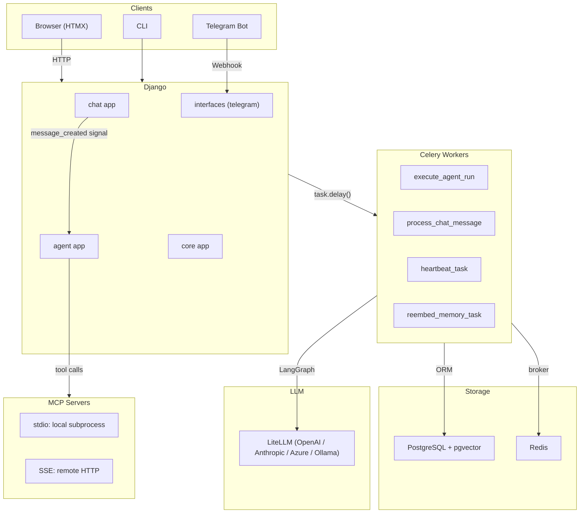
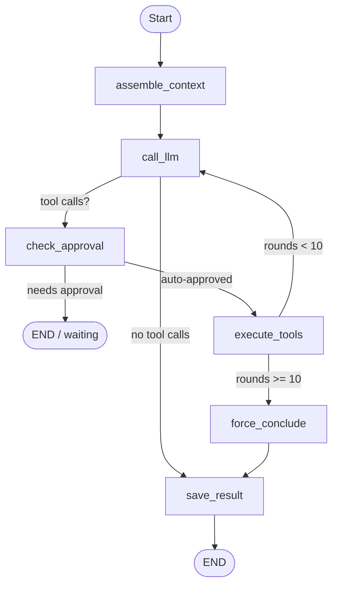
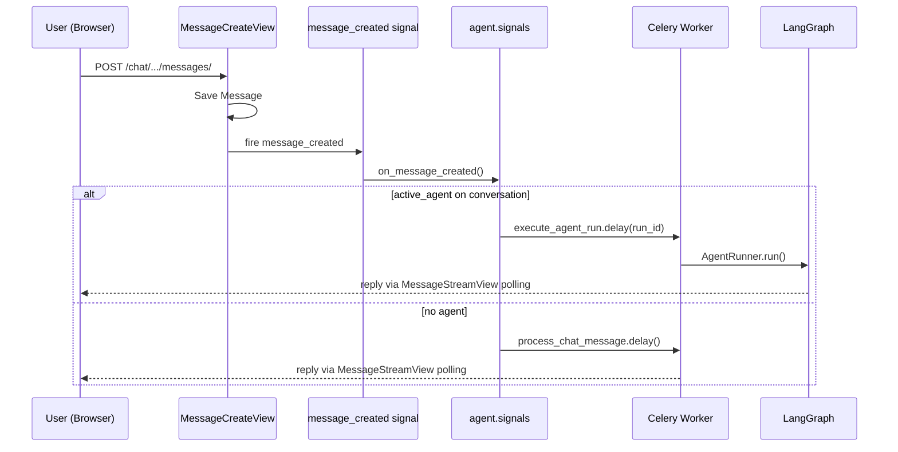
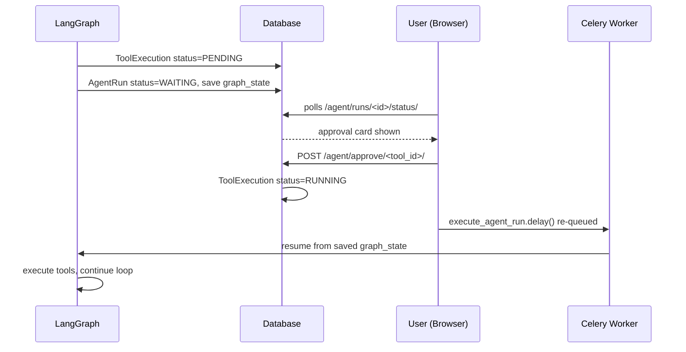

# System Architecture

## Overview

A Django-based AI agent platform with real-time chat, autonomous agent execution via LangGraph, MCP server integration, a multi-source embedding-routed skill system, a RAG knowledge base, and vector memory. Designed around HTMX for frontend interactivity and Celery for async task processing.

---

## High-Level Component Diagram



---

## Django Apps

### `chat` — Conversations & simple LLM chat

**Models**
- `Conversation` — tracks interface (web/telegram/cli), active agent, model config, system prompt, temperature
- `Message` — individual messages with role (user/assistant/system/tool) and token counts

**Key views** (all HTMX-enabled)
- `ConversationDetailView` — full chat interface with markdown rendering and slash-command autocomplete
- `MessageCreateView` — saves user message, fires `message_created` signal
- `MessageStreamView` — polling endpoint; returns typing indicator or assistant reply; pushes OOB title swaps when title is first generated
- `ConversationAgentToggleView` — enable/disable agent for a conversation

**Chat UI features**
- Markdown rendering (marked.js + highlight.js for code blocks)
- Slash-command autocomplete (`/` prefix shows available skills)
- `@mcp-name` autocomplete — typing `@` shows a dropdown of configured MCP servers with live connection status (green/grey dot)
- LLM-generated conversation titles — generated on the first exchange via a lightweight LLM call in `_generate_conversation_title()` then pushed via HTMX OOB swap to both the chat heading and the sidebar entry
- **Tool call visibility** — unique tool chips (with call counts) always shown below the "Show trace" toggle; no click needed to see which tools ran

**Flow**: User types → `MessageCreateView` saves message → fires signal → `agent.signals.on_message_created` creates `AgentRun` and queues Celery task → `MessageStreamView` polls until reply appears.

---

### `agent` — Agent orchestration, tools, memory, MCP, skills, knowledge

**Models**
- `Agent` — name, system prompt, tools list, model, `is_default`
- `AgentRun` — execution record: status, input/output, graph_state (JSON), triggered_skills
- `ToolExecution` — audit log per tool call: status, input, output, duration_ms, parallel_group, approval
- `Memory` — long-term memory paragraphs with pgvector embeddings (1536-dim)
- `LLMUsage` — token counts and estimated cost per LLM call
- `Skill` — registry of installed skills with path, source, enabled flag, trust status
- `SkillEmbedding` — pgvector embedding (1536-dim) per skill for semantic routing
- `TrustedSkillSource` — allowlist of non-workspace skill source directories
- `KnowledgeDocument` — RAG knowledge base entries with URL/file source and pgvector embeddings
- `HeartbeatLog` — records each heartbeat trigger

> **Note**: `MCPServer` Django model was removed (spec 029). MCP server configuration is now stored in `agent/workspace/mcp_servers.json` as a `MCPServerConfig` dataclass, managed by `agent/mcp/config.py`.

**Execution**: `AgentRunner` → `build_graph()` → LangGraph `StateGraph.invoke()`. See [agent-loop.md](agent-loop.md) for the full flowchart.

---

### `core` — Shared utilities

- `TimeStampedModel` — abstract base with `created_at`, `updated_at`
- `core.llm.get_completion()` — LiteLLM call with usage tracking
- `core.memory.embed_text()` — OpenAI `text-embedding-3-small` via LiteLLM
- `core.memory.search_memories()` — cosine similarity search in pgvector

---

## Agent Loop (LangGraph)

See [agent-loop.md](agent-loop.md) for the full flowchart. Summary:



**State** carried between iterations: `pending_tool_calls`, `tool_results`, `assistant_tool_call_message`, `tool_call_rounds`, `visited_urls`, `output`, plus pre-built context fields set by `assemble_context`: `_system_content`, `_tools_schema`, `_model`, `_forced_mcp`, `_tool_listing`.

---

## System Prompt Assembly

Built in `_build_system_context(query, forced_skill, suppress_skills)` once per run inside `assemble_context` using a **parallel ThreadPoolExecutor** (4 workers) to fetch skills, memory, knowledge, and MCP resources concurrently:

| Order | Content | Source | Suppressed when |
|-------|---------|--------|----------------|
| 1 | Current datetime + timezone | `datetime.now()` | — |
| 2 | Universal rules | `workspace/AGENTS.md` | — |
| 3 | Persona/tone | `workspace/SOUL.md` | — |
| 4 | Skill catalog (compact index of all skills) | `build_skill_catalog()` | `@mcp`-only mode |
| 5 | Matched skill bodies | `workspace/skills/*/SKILL.md` + `rules/*.md` appended | `@mcp`-only mode |
| 6 | Relevant memories | pgvector top-5 similarity search | — |
| 7 | MCP resources | `always_include` resource URIs | — |
| 8 | MCP server connectivity status | `MCPConnectionPool` + `MCPRegistry` | — |
| 9 | Reference knowledge | RAG retrieval from `KnowledgeDocument` | — |
| 10 | Tool output formatting rule | Static instruction | — |
| 11 | Parallel tool call instruction | Static instruction | — |
| 12 | Reasoning transparency instruction | Static instruction | — |

> **Parallel assembly**: steps 5 (skills), 6 (memory), 9 (knowledge), and 7 (MCP resources) are fetched concurrently via `ThreadPoolExecutor(max_workers=4)`. Total wall time ≈ slowest single lookup.

---

## Input Directives

Two special prefixes in the chat input control context assembly and tool routing:

| Directive | Example | Effect |
|-----------|---------|--------|
| `/skill-name` | `/edwm-wip-movement what is today's move?` | Only that skill injected; embedding routing bypassed |
| `@mcp-name` | `@fab-mcp get lots on hold` | Only that server's tools in schema; **all skills suppressed** |
| `@mcp-name tools` | `@fab-mcp tools` | Returns tool listing immediately, no LLM call |
| `/skill @mcp` | `/edwm-wip-movement @fab-mcp query` | Named skill + named MCP only |

Typing `@` in the chat input triggers an autocomplete dropdown listing all configured MCP servers with their live connection status.

---

## Skill System

### Multi-Source Discovery (spec 023)

Skills are discovered from multiple source directories in priority order:

| Priority | Source | Trust |
|----------|--------|-------|
| 1 (highest) | `agent/workspace/skills/` | Always trusted (native workspace) |
| 2 | `.agents/skills/` (project root) | Requires `TrustedSkillSource` DB record |
| 3 | `~/.agents/skills/` (user home) | Requires `TrustedSkillSource` DB record |
| 4 | `~/.claude/skills/` (Claude Code) | Requires `TrustedSkillSource` DB record |
| 5 | `AGENT_EXTRA_SKILLS_DIRS` (env var) | Requires `TrustedSkillSource` DB record |

`collect_all_skills(check_db_trust=True)` merges all sources; skills from a higher-priority source shadow same-named skills from lower-priority sources. Untrusted skills appear in the Skills UI but are **never injected into the LLM context**.

### Embedding-Based Routing (spec 022)

Skill selection uses semantic similarity as the primary routing signal:

- **Model**: `openai/text-embedding-3-small` (1536 dimensions)
- **Storage**: `SkillEmbedding` table with HNSW cosine index
- **Threshold**: `SIMILARITY_THRESHOLD = 0.55` (configurable via `AGENT_SKILL_SIMILARITY_THRESHOLD`)
- **Embedded text**: `name + description + triggers (first 20) + examples (first 10) + body[:500]`
- **Fallback 1**: keyword match against `metadata.triggers`
- **Fallback 2**: regex match against `metadata.trigger_patterns`

`rules/*.md` files in a skill's directory are appended to the skill body **at injection time** (not embed time), so they do not pollute routing embeddings.

### Skill YAML Frontmatter

```yaml
---
name: web-research
description: Searching the web for current information
metadata:
  triggers: [search, web, browse, news, price]
  trigger_patterns: ["find .* online", "look up"]
  examples:
    - "What's the latest news about..."
    - "Search for the price of..."
  version: 1
---
## Full instructions here...
```

GavinAgent-specific fields (`triggers`, `examples`, `trigger_patterns`, `version`) live inside `metadata:`. Top-level lists are accepted for backward compatibility.

### Sync Workflow

```
agent/workspace/skills/ ──sync_claude_code──► ~/.claude/skills/
                         ◄──import_skills──── any source directory
```

- `sync_claude_code` — push workspace skills to `~/.claude/skills/` (Anthropic Claude Code format)
- `import_skills` — import skills from any source dir into workspace (with YAML compliance fixing)

### Built-in Skills (19 total)

| Skill | Description |
|-------|-------------|
| `charts` | Generate matplotlib charts |
| `web-research` | Web search and URL fetching |
| `data-analysis` | Statistical analysis on tabular data |
| `stock-chart` | Historical stock price charts |
| `weather` | Current weather and forecast |
| `workflow-management` | Create/update scheduled workflows |
| `find-skills` | Discover and install agent skills |
| `Skill-Development` | Create and improve skills |
| `edwm-wip-movement` | FAB production WIP movement queries |
| `pdf` | Extract text from PDF files |
| `xlsx` | Read and analyse Excel files |
| `sql-query` | Execute SQL against the session DB |
| `image-analysis` | Analyse and describe images |
| `code-review` | Review code for bugs and issues |
| `git-workflow` | Git operations and branch management |
| `api-testing` | Test REST APIs |
| `document-writer` | Draft structured documents |
| `data-pipeline` | ETL and data transformation |
| `notification` | Send notifications via various channels |

---

## RAG Knowledge Base

`KnowledgeDocument` model stores documents ingested from URLs or files. Each document is chunked and embedded into pgvector. During system prompt assembly, `_build_knowledge_section(query)` calls `agent.rag.retriever.retrieve_knowledge()` (cosine similarity search) and injects the top results as a "## Reference Knowledge" section.

**Management**: `ingest_documents` management command; `/agent/knowledge/` UI for add/toggle/reingest/delete.

---


## Tool System

Tools are auto-discovered from `agent/tools/*.py` (any `BaseTool` subclass):

| Tool | Description | Execution |
|------|-------------|-----------|
| `file_read` | Read workspace files | Parallel |
| `file_write` | Write workspace files | Serial |
| `web_read` | Fetch URLs (dedup enforced) | Parallel |
| `shell` | Execute shell commands | Serial |
| `api_get` / `api_post` | HTTP requests | Parallel |
| `get_datetime` | Current date/time with timezone | Parallel |
| `chart` | Generate matplotlib charts | Parallel |
| `web_search` | Search the web via SearXNG | Parallel |
| `skill` | Invoke a named skill as a sub-agent | Parallel |
| `workflow` | Create/update scheduled workflows | Parallel |

MCP tools are discovered dynamically from connected MCP servers and registered alongside built-ins.

**Parallel execution**: `execute_tools` separates tools into a parallel batch (`ThreadPoolExecutor`, max 8 workers, configurable via `AGENT_TOOL_PARALLELISM`) and a serial queue (`file_write`, `shell`). Serial tools run after the parallel batch completes.

---

## Background Tasks (Celery)

| Task | Trigger | Description |
|------|---------|-------------|
| `execute_agent_run` | Signal / tool approval | Run or resume a LangGraph agent run |
| `process_chat_message` | User message (no agent) | Call LLM for plain chat reply; generates conversation title on first message |
| `heartbeat_task` | Celery Beat (every 30 min) | Read `HEARTBEAT.md`, create AgentRun for unchecked items |
| `reembed_memory_task` | Manual / file write | Re-embed changed paragraphs in `MEMORY.md` into pgvector |

**Infrastructure**: Redis as broker and result backend. `django_celery_beat` for schedule management.

---

## Memory Systems

**Short-term**: LangGraph `AgentState` (in-memory during run, cleared after).

**Long-term**: pgvector in PostgreSQL.
- Source: `workspace/memory/MEMORY.md` — free-text paragraphs
- Embedding model: `openai/text-embedding-3-small` (1536 dimensions)
- Index: HNSW with cosine distance
- Recall: top-5 most similar paragraphs injected into every system prompt
- Re-embedding: paragraph-level hash diffing (only changed paragraphs re-embedded)

**Conversation history**: last N messages truncated to `AGENT_CONTEXT_BUDGET_TOKENS` (default: 8,000).

---

## MCP Integration

`MCPConnectionPool` is a singleton with a dedicated async event loop in a background thread. It manages connections to all enabled MCP servers.

**Configuration** (spec 029): MCP server config is stored in `agent/workspace/mcp_servers.json` as `MCPServerConfig` dataclasses. The `MCPServer` Django model has been removed. Config is managed via `agent/mcp/config.py` (`load_servers`, `upsert_server`, `remove_server`) and the `/agent/mcp/` UI.

**Transports**
- `stdio` — local subprocess (e.g. `npx -y @modelcontextprotocol/server-brave-search`)
- `SSE` — remote HTTP streaming endpoint

**Features**
- Tool discovery on connect (registered into `MCPRegistry`)
- `always_include` resource URIs injected into every system prompt
- Per-server `auto_approve_tools` list
- Connection status tracked per-server in the pool
- Auto-disable after 10 consecutive connection failures (spec 024)
- Session expiry detection — reconnects on 401/403 or SSE session-expired events (spec 024)
- `_unwrap_error()` helper unwraps Python 3.11+ `BaseExceptionGroup` to expose the root cause in logs and UI

**`@mcp-name` directive**: When the user types `@mcp-name` in a query, only tools from that server are included in the LLM tools schema, and `mcp_servers_active` in the progress UI shows only that server. Type `@mcp-name tools` to list that server's tools without calling the LLM.

**GavinAgent as MCP server**: `mcp_server.py` exposes GavinAgent's own tools over SSE (`/mcp/sse/`) so external clients (e.g. Claude Desktop, Claude Code) can use them.

---

## Signal & Event Flow



### Tool Approval Flow



---

## URL Structure

```
/chat/                                         Conversation list
/chat/conversations/<id>/                      Chat interface
/chat/conversations/<id>/messages/             POST new message
/chat/conversations/<id>/messages/<id>/stream/ Poll for reply

/agent/                                        Dashboard
/agent/runs/                                   Run list
/agent/runs/<id>/                              Run detail + tool trace
/agent/runs/<id>/status/                       HTMX polling fragment
/agent/agents/                                 Agent CRUD
/agent/tools/                                  Tool registry + policy
/agent/skills/                                 Skill management (multi-source tabs)
/agent/skills/sync-claude/                     Sync workspace → ~/.claude/skills/
/agent/skills/import-from-project/             Import skills from source directory
/agent/skills/embed-all/                       Re-embed all skills
/agent/api/skills/                             JSON skill list API
/agent/api/mcp/                                JSON MCP server list + live status API
/agent/memory/                                 Memory editor + search
/agent/mcp/                                    MCP server config
/agent/knowledge/                              RAG knowledge base management
/agent/workspace/<filename>/                   Workspace file editor
/agent/workflows/                              Scheduled workflow CRUD
/agent/monitoring/                             Usage + health
/agent/logs/                                   Agent run logs

/mcp/sse/                                      GavinAgent MCP server (SSE)
```

---

## Frontend Stack

| Library | Version | Usage |
|---------|---------|-------|
| HTMX | 2.0.4 | Partial updates, polling, OOB swaps |
| Alpine.js | 3.14.1 | Local UI state (toggles, collapse) |
| Tailwind CSS | CDN | Styling |
| marked.js | CDN | Markdown rendering in chat |
| highlight.js | CDN | Syntax highlighting in code blocks |

**Patterns**:
- `hx-swap-oob` — update elements outside the main swap target (status badge, sidebar title, conversation title)
- `hx-trigger="every 2s"` — polling for run status and message stream
- Template convention: `_partial.html` prefix for HTMX fragments

---

## Workspace Directory

```
agent/workspace/
├── AGENTS.md              Universal agent behaviour rules
├── SOUL.md                Persona and tone layer
├── HEARTBEAT.md           Periodic task checklist (- [ ] format)
├── memory/
│   └── MEMORY.md          Long-term memory (embedded into pgvector)
└── skills/
    ├── charts/
    │   ├── SKILL.md
    │   └── rules/         Optional rule files appended at injection time
    ├── web-research/SKILL.md
    ├── data-analysis/SKILL.md
    ├── stock-chart/SKILL.md
    ├── weather/SKILL.md
    ├── workflow-management/SKILL.md
    ├── find-skills/SKILL.md
    ├── Skill-Development/SKILL.md
    └── ... (19 skills total)
```

All files are editable via the Agent UI at `/agent/workspace/`. Chart images (`chart_*.png`) are stored here too.

---

## Configuration

Settings split across `config/settings/`:
- `base.py` — shared: DB, LiteLLM, Redis, Celery, workspace paths
- `local.py` — dev: `DEBUG=True`
- `production.py` — prod: hardened

Key environment variables:

| Variable | Purpose |
|----------|---------|
| `DATABASE_URL` | PostgreSQL connection |
| `REDIS_URL` | Celery broker/backend |
| `LITELLM_DEFAULT_MODEL` | Default LLM (e.g. `openai/gpt-4o-mini`) |
| `FERNET_KEY` | MCP env encryption |
| `TELEGRAM_BOT_TOKEN` | Telegram integration |
| `LANGSMITH_API_KEY` | LangSmith tracing (optional) |
| `LANGSMITH_PROJECT` | LangSmith project name (optional) |
| `AZURE_API_KEY` | Azure OpenAI key |
| `AZURE_API_BASE` | Azure OpenAI endpoint |
| `AZURE_API_VERSION` | Azure OpenAI API version |
| `MAX_TOOL_OUTPUT_CHARS` | Tool output truncation (default: 20,000) |
| `AGENT_CONTEXT_BUDGET_TOKENS` | History truncation budget (default: 8,000) |
| `AGENT_HISTORY_WINDOW` | Max messages kept in history (default: 10) |
| `AGENT_TOOL_PARALLELISM` | Max parallel tool workers (default: 8) |
| `AGENT_SKILL_SIMILARITY_THRESHOLD` | Skill routing cosine threshold (default: 0.55) |
| `AGENT_EXTRA_SKILLS_DIRS` | Extra skill source directories (colon-separated) |
| `AGENT_TIMEZONE` | Timezone injected into system prompt (default: UTC) |

---

## Management Commands

| Command | Description |
|---------|-------------|
| `sync_claude_code` | Push workspace skills to `~/.claude/skills/` (Anthropic format) |
| `import_skills` | Import skills from a source directory into workspace |
| `embed_skills` | Embed all workspace skills into pgvector |
| `ingest_documents` | Ingest documents into the RAG knowledge base |
| `reembed_memory` | Re-embed changed paragraphs in `MEMORY.md` |
| `sync_claude_code --skills-only` | Only sync skills (skip other workspace files) |

---

## Key Files

```
config/
  celery.py              Celery app, MCP pool init/shutdown hooks
  urls.py                Root URL routing

chat/
  models.py              Conversation, Message
  views.py               HTMX views (OOB title swaps in MessageStreamView)
  services.py            ChatService (LLM reply)
  signals.py             message_created signal
  tasks.py               process_chat_message, _generate_conversation_title

agent/
  models.py              Agent, AgentRun, Memory, Skill, SkillEmbedding,
                         TrustedSkillSource, KnowledgeDocument, LLMUsage, ...
                         (MCPServer removed in spec 029 — see mcp/config.py)
  views.py               Dashboard, CRUD, approval, monitoring, skills UI,
                         MCPServerListApiView (/agent/api/mcp/)
  runner.py              AgentRunner (sync executor + resumption)
  signals.py             on_message_created → trigger agent run
  tasks.py               Celery tasks
  graph/
    graph.py             LangGraph StateGraph + routing
    nodes.py             Node functions + _build_system_context (parallel assembly)
                         + _parse_slash_skill, _parse_at_mcp, _is_mcp_tools_query,
                           _format_mcp_tool_listing, _build_tools_schema
    state.py             AgentState TypedDict (inc. _forced_mcp, _tool_listing, ...)
  tools/                 BaseTool implementations (auto-discovered)
  skills/
    discovery.py         collect_all_skills() — multi-source with trust model
    embeddings.py        find_relevant_skills(), _skill_embed_text(), build_skill_catalog()
    loader.py            SkillLoader — reads SKILL.md, parses frontmatter
    registry.py          SkillRegistry — in-memory skill index
  mcp/
    config.py            MCPServerConfig dataclass + load/save/upsert/remove
    pool.py              MCPConnectionPool singleton
    registry.py          MCPRegistry — tool lookup (server_name for @mcp filtering)
    client.py            SSE/stdio MCP client, _unwrap_error()
  memory/
    long_term.py         search_long_term() via pgvector
    short_term.py        In-run working memory
  rag/
    retriever.py         retrieve_knowledge() — RAG search
    ingestor.py          Document ingestion + chunking
  workspace/             AGENTS.md, SOUL.md, mcp_servers.json, skills/, memory/
  management/commands/
    sync_claude_code.py  Push skills to ~/.claude/skills/
    import_skills.py     Import skills from source directories
    embed_skills.py      Embed skills into pgvector
    ingest_documents.py  RAG document ingestion

core/
  llm.py                 get_completion() via LiteLLM
  memory.py              embed_text(), search_memories()

mcp_server.py            GavinAgent as MCP server (SSE endpoint)
```
