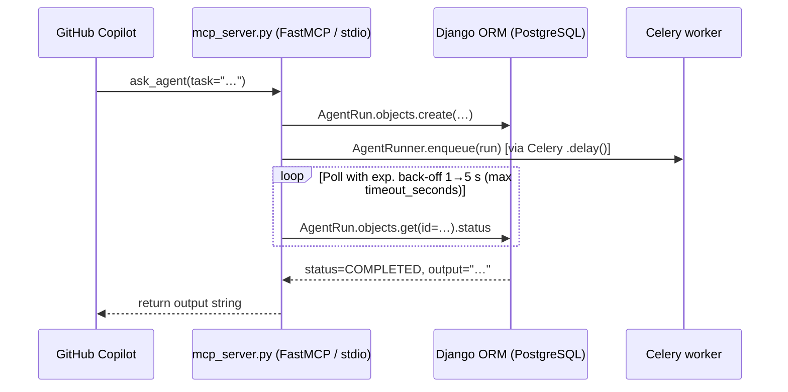

# 019 — GavinAgent as MCP Server for GitHub Copilot

## Goal

Expose this project's Agent as an MCP tool so that GitHub Copilot (and any
other MCP-capable IDE client) can invoke it directly from the editor via
natural-language task delegation.

## Background

GitHub Copilot Agent mode supports MCP servers declared in `.vscode/mcp.json`.
This project is currently an MCP **client** — it connects to external MCP
servers (EDWM, FAB, Research, etc.) and calls their tools during agent runs.

To make Copilot a **caller** instead, we need to expose a thin MCP **server**
layer on top of the existing Django/LangGraph infrastructure. Copilot sends a
task description; the server creates an `AgentRun`, blocks until it completes,
and returns the output. The agent's full capability set (web search, file I/O,
shell, charting, memory, RAG, connected MCP servers, skills) is then available
to Copilot with a single tool call.

This project already has `mcp>=1.26.0` in its dependencies, so no new packages
are required.

---

## Proposed Solution

### Components

| File | Role |
|------|------|
| `mcp_server.py` | Standalone MCP server script (FastMCP, stdio transport) |
| `.vscode/mcp.json` | VS Code / Copilot MCP server declaration |
| `pyproject.toml` | Add `[project.scripts]` entry so `uv run mcp_server` works |

### Transport choice

**stdio** — Copilot launches the server as a child process and communicates
over stdin/stdout. This requires no open ports, no authentication, and no
separate service. It is the standard choice for local MCP servers in VS Code.

### Execution model



### Exposed tools

#### `ask_agent`

Submit a natural-language task to the default GavinAgent and wait for the
result. The agent has access to web search, file read/write, shell execution,
charting, external APIs, MCP servers, skills, and long-term memory.

**Parameters**

| Name | Type | Required | Description |
|------|------|----------|-------------|
| `task` | `str` | ✓ | Natural-language description of what to do |
| `agent_name` | `str` | — | Name of a specific agent (default: `is_default=True`) |
| `timeout_seconds` | `int` | — | Max wait time (default: `AGENT_MCP_TIMEOUT_SECONDS`, 300) |

**Returns** — `{"output": str}` on success, `{"error": str}` on failure or
timeout. Error and timeout messages include the `AgentRun.id` for investigation.

**Implementation notes**

- `TriggerSource.CLI` is used; no `chat.Conversation` is created (the run is
  not visible in the Chat sidebar).
- Polling uses exponential back-off starting at 1 s, capped at 5 s
  (not a fixed 2 s interval as originally planned).

#### `list_agents`

Return a list of all active agents. No parameters. Useful for discovering
available agents before calling `ask_agent` with a specific `agent_name`.

**Returns** — `list[dict]` with keys `name`, `description`, `model`,
`is_default` for each active agent, ordered by name.

#### `list_skills`

Return a list of all enabled skills registered in the database.
No parameters.

**Returns** — `list[dict]` with keys `name`, `description`, ordered by name.

#### `run_skill`

Execute a workspace skill handler directly by name, bypassing the agent loop.
Only works for skills that have a `handler.py` in their skill directory.

**Parameters**

| Name | Type | Required | Description |
|------|------|----------|-------------|
| `skill_name` | `str` | ✓ | Skill directory name (e.g. `"weather"`, `"charts"`) |
| `input` | `str` | ✓ | Input string passed to the skill's `handle()` function |

**Returns** — `{"result": str}` on success, `{"error": str}` on failure.

---

## Architecture detail

### Django bootstrap

`mcp_server.py` sets `DJANGO_SETTINGS_MODULE` before importing Django, then
calls `django.setup()`. This gives it full ORM access without running a web
server. The script runs in the same virtualenv as the rest of the project.

### Celery dependency

`ask_agent` creates an `AgentRun` and enqueues it via `AgentRunner.enqueue()`
(which calls `execute_agent_run.delay()`). **The Celery worker must be running**
for the agent to execute. This is already a requirement for normal web/chat use.

If no worker is running, the run stays `PENDING` and `ask_agent` returns a
timeout message after `timeout_seconds`.

### Approval gates

If the agent hits a tool that requires human approval, the run pauses at
`WAITING` status. `ask_agent` will time out waiting. This is a known
limitation (see Out of Scope). The workaround is to ensure all tools that
Copilot is likely to trigger are in `auto_approve_tools` for the relevant MCP
server, or have `ApprovalPolicy.AUTO`.

### Settings

| Setting | Default | Purpose |
|---------|---------|---------|
| `AGENT_MCP_TIMEOUT_SECONDS` | `300` | Max seconds `ask_agent` polls before giving up |
| `DJANGO_SETTINGS_MODULE` | `config.settings.local` | Injected by `.vscode/mcp.json` |

---

## `.vscode/mcp.json` shape

```json
{
  "servers": {
    "gavin-agent": {
      "type": "stdio",
      "command": "uv",
      "args": ["run", "python", "mcp_server.py"],
      "env": {
        "DJANGO_SETTINGS_MODULE": "config.settings.local"
      }
    }
  }
}
```

Copilot reads this file on workspace open and starts the server on demand.
The server process exits when Copilot terminates it.

---

## Out of Scope

- **SSE / HTTP transport** — stdio is sufficient for local IDE use; adding an
  HTTP transport would require a separate long-running process and auth.
- **Streaming partial output** — MCP tool calls are request/response; streaming
  the agent's reasoning trace to Copilot is not supported by the protocol.
- **Approval gate UI in Copilot** — when a tool needs approval, there is no way
  to surface the approval card inside Copilot. The run will time out.
- **Multi-turn conversation from Copilot** — each `ask_agent` call is a new
  `AgentRun` with no shared conversation context.
- **Authentication** — the server runs locally over stdio; no credentials needed.

## Open Questions

1. ~~Should the server create a `chat.Conversation` so the run is visible in the
   Chat sidebar?~~ **Decided: no.** Uses `TriggerSource.CLI`; runs are visible
   in the Agent Runs admin but not in the Chat sidebar.
2. Should there be a `get_run_status(run_id)` tool for async workflows where
   the caller does not want to block?
3. Should `ask_agent` accept a `conversation_id` to continue an existing
   chat thread?
